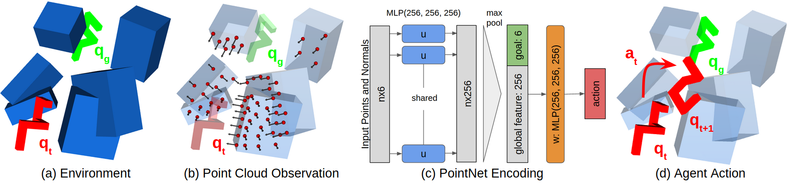

# Hard-Exploration-for-Maze-Solving

This is an adaptation of the code from https://github.com/rstrudel/nmprepr/blob/recvis20/README.md ( Robin Strudel, Ricardo Garcia, Justin Carpentier, Jean-Paul Laumond, Ivan Laptev, Cordelia Schmid, CoRL 2020) to apply curriculum learning for maze solving.

The main differences from the original code are:

- modification of maze.py, maze_generator.py and __init__.py in mpenv/envs to create a new environment ('Maze-Obstacles-Dist-v0') that takes as argument: grid_size, n_obstacles and distance_start_goal.

```
env = gym.make("Maze-Obstacles-Dist-v0", grid_size=4, n_obstacles=1, distance_start_goal=0.2)
```

- modification of sac.py in nmp/launcher, to be able to resume learning from a .pkl file
- added files curriculum.py in nmp/launcher and train_curu.py in nmp where the curriculum is defined and called




- [Project Page](https://www.di.ens.fr/willow/research/nmp_repr/)
- [Paper](https://arxiv.org/abs/2008.11174)


### Table of Content

- [Setup](#setup)
- [Training](#train)
- [Run](#run)
- [Curriculum] (#curriculum)


## Setup

Download the code
```
git clone https://github.com/achraf-azize/Hard-Exploration-for-Maze-Solving
```

To create a new conda environment containing dependencies
```
conda env create -f environment.yml
conda activate nmprepr
```

To update a conda environment with dependencies
```
conda env update -f environment.yml
```

## Train

### Maze

To train a planning policy on maze environments generated by a 3x3 grid
```
python -m nmp.train Maze-Simple-v0 maze_baseline --horizon 75 --seed 0 --epochs 1500
```

For 5x5 grids use `Maze-Medium-v0` and for 7x7 grid use `Maze-Hard-v0`.
<p float="center">
    
    
    
</p>

Note that the mazes are randomly generated. At each episode the agent has to solve a problem with a different maze.

### Results

On `Maze-Simple-v0` you should get a success rate similiar to the curve below:


### Monitor

You can monitor experiments with
```
tensorboard --logdir=/path/to/experiment
```

## Run

Run a planning policy and visualize it with
```
python -m nmp.run Maze-Simple-v0 --exp-name log_dir/params.pkl --seed 100 --horizon 75
```
       
Evaluate the success rate of a policy on 100 episodes
```
python -m nmp.run Maze-Simple-v0 --exp-name log_dir/params.pkl --seed 100 --horizon 75 --episodes 100
```

## Curriculum 
Run the curriculum learning with
```
python -m nmp.train_curu Maze-Obstacles-Dist-v0 maze_curu_log --horizon 75 --seed 0 --max-epochs 1500 --resumetraining "/home/achraf/Downloads/params.pkl" --epochs-per-curu 10 --grid-size 5 --curu-obstacles-step 4 --success-to-next 0.3 --horizon 200
```


@inproceedings{strudelnmp2020,
title={Learning Obstacle Representations for Neural Motion Planning},
author={R. {Strudel} and R. {Garcia} and J. {Carpentier} and J.P. {Laumond} and I. {Laptev} and C. {Schmid}},
journal={Proceedings of Conference on Robot Learning (CoRL)},
year={2020}
}
```
